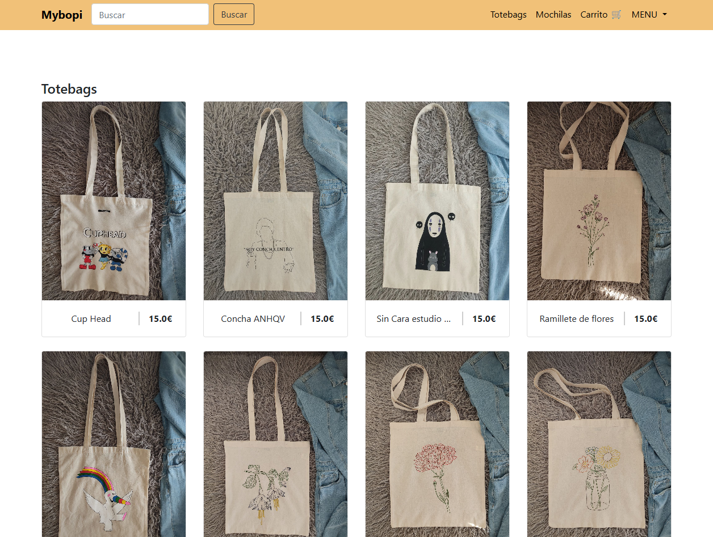
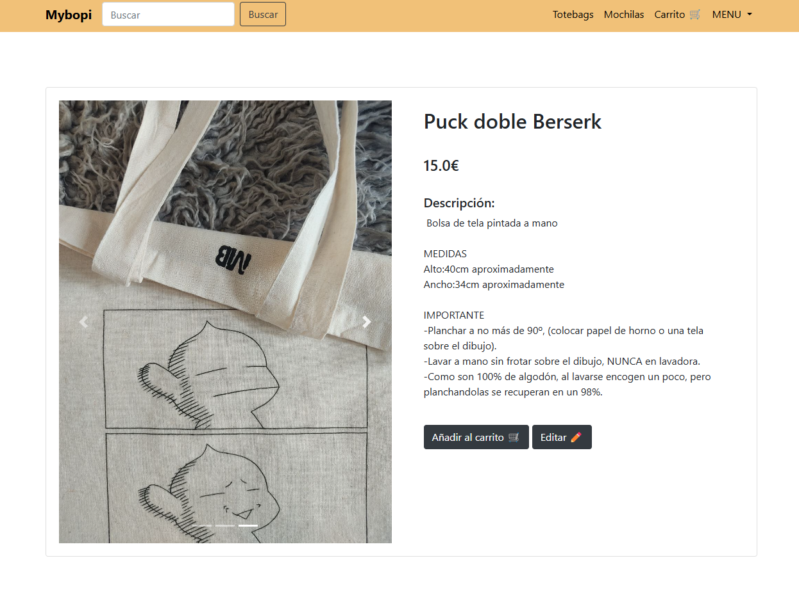
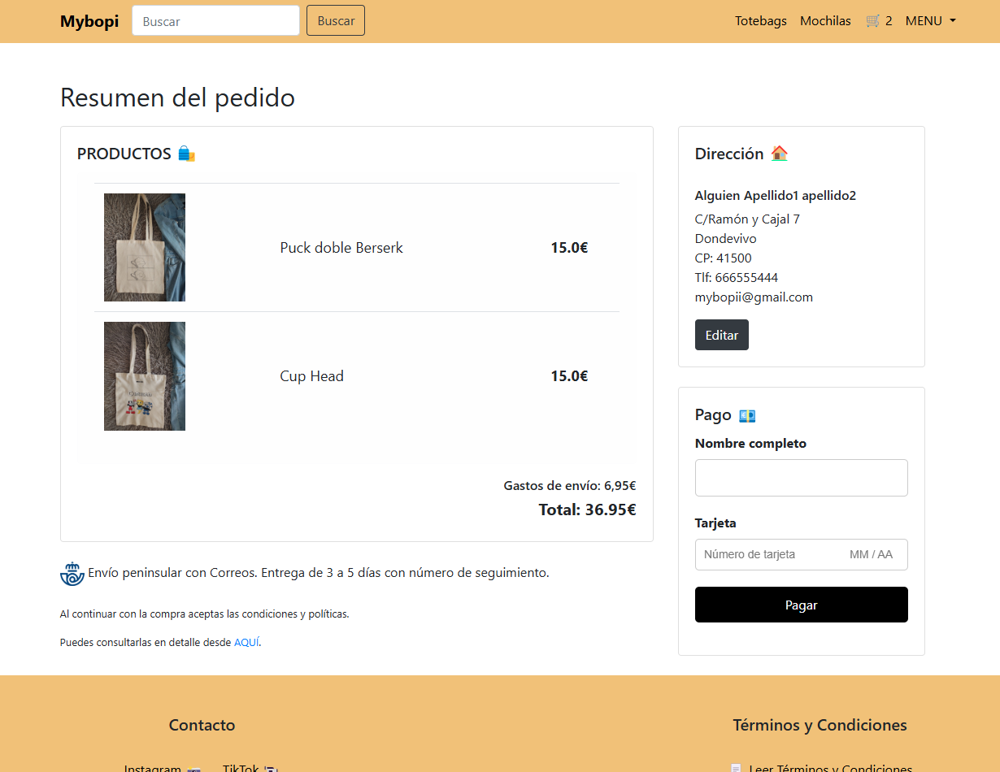
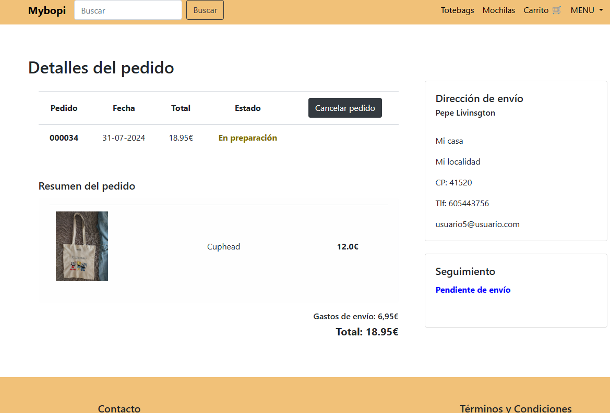
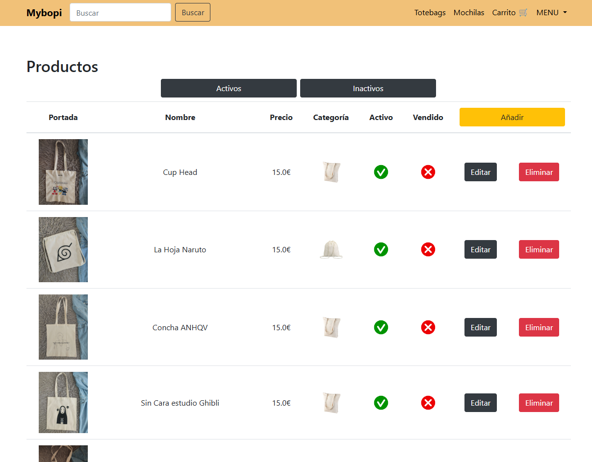
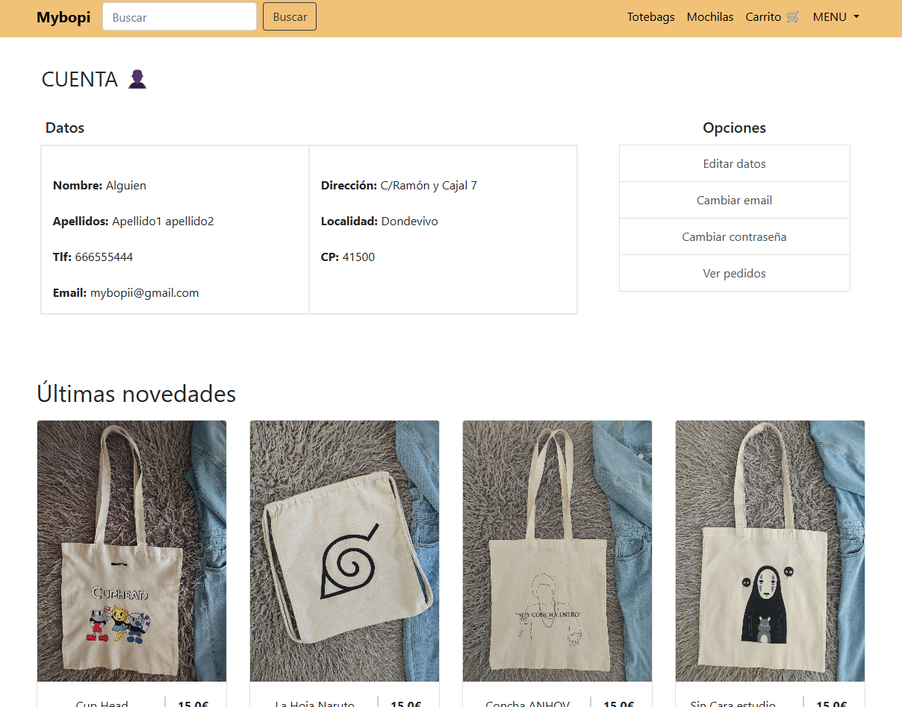

# Mybopi

## ¿Qué es Mybopi?
Mybopi es una app web, accesible desde https://mybopi.es/, para la venta de productos pintados a mano. Se ha realizado a petición del cliente y se ha adaptado a sus necesidades.

## ¿Qué funciones tiene?
Mybopi cuenta con un sistema de registro y login seguros gracias a Spring Security, permitiendo que los usuarios puedan acceder a la app y a sus funcionalidades. Los usuarios se dividen a su vez en administradores y usuarios normales. Los administradores tienen acceso al crud de usuarios, productos y pedidos realizados. Los usuarios solo pueden realizar y ver sus pedidos, además de editar sus datos. Otras funciones disponibles son el envío de correos al realizar ciertas acciones, el borrado de cuentas de usuarios automático (siempre que se haya solicitado) e integración de pagos con Stripe.

### Inicio
En el inicio podemos ver las dos categorías posibles de productos, además de las últimas novedades en la parte inferior y, si estamos logueados, un menú en la barra de navegación. Tanvién vemos un cuadro de búsqueda y accesos directos a las categorías de productos, visibles en todo momento. Esta pantalla y la de productos, están disponibles para todos los usuarios, tengan o no una cuenta registrada.

### Totebags y Mochilas
Vemos los dos tipos de productos, tengan o no una cuenta registrada. En este caso, vemos las totebags disponibles, ordenadas por fecha de modificación.

### Pantalla de un producto
Aquí vemos la pantalla de un producto específicos, donde aparece su nombre, descripción y precio, además de las imágenes necesarias. Si el usuario es admin, verá el botón de "Editar" a la derecha del botón de añadir al carrito. Si añadimos al carrito sin una sesión iniciada, nos llevará a la pantalla de registro.

### Pantalla de pago y resúmen del pedido
Esta es la pantalla de pago y resúmen del pedido, accedemos a ella después de proceder desde la pantalla del carrito. Vemos el listado de productos añadidos y también vemos la dirección de envío, que si no está completa, el recuadro se resaltará en rojo y no permitirá realizar el pago.

### Pantalla del pedido y seguimiento
Una vez realicemos el pago, podremos ver el pedido en todo momento, así como un enlace de seguimiento una vez que esté disponible. Los administradores pueden cambiar el estado del pedido y añadir el enlace de seguimiento, por otro lado, los usuarios pueden cancelar el pedido siempre y cuando no se haya enviado. Si el pedido ya se ha enviado, los usuarios pueden tramitar la devolución, siempre acorde a los términos y condiciones. Una vez pasados 30 días desde la compra, la opción de la devolución dejará de estar disponible.

### Listado de productos añadidos
Los administradores tienen acceso al listado de productos, donde pueden añadir, editar o eliminar productos. El listado tiene paginación y un filtro para distinguir entre productos activos o no activos. También se puede ver si el producto se ha vendido o no. Contamos con un listado similar para los usuarios registrados y los pedidos realizados.

### Cuenta de usuario
Esta es la pantalla de Cuenta, donde podemos ver nuestros datos y editarlos. También podemos cambiar el email y la contraseña de la cuenta. Por otro lado, también tenemos acceso al listado de pedidos realizados.

## ¿Cómo se ha hecho?
Mybopi ha sido desarrollado con Java, utilizando Spring Boot y Spring Security, además de Thymeleaf, Bootstrap y JavaScript. También se ha utilizado una base de datos MySQL, creada mediante JPA, para almacenar los datos de los usuarios, los productos y los pedidos. Se ha desplegado con docker en un servidor web con Ubuntu, quedando disponible para todos los usuarios en https://mybopi.es/.